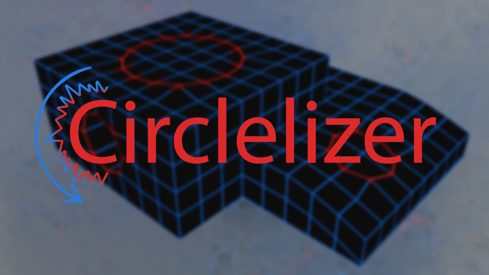
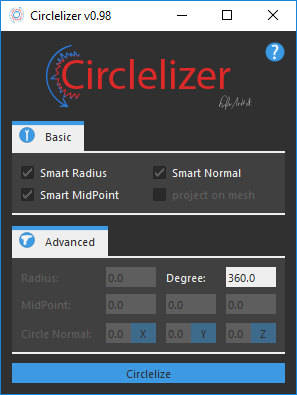
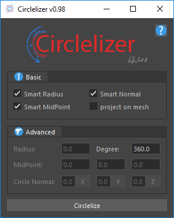

# circlelizer-maya

**Circlelizer** is a plugin for Maya which is written in Python with *Maya API 2.0*. It generates a circle from a given selection. You can either let the program calculate all parameters or define your own.

## GUI

its also possible to deactive the style:

## Changelog
***Latest Versions:***

circlelize v0.98
circlelizerInterface v2.0

***v0.98 Changelog***

- merged version files
- updated mod file for merged Maya files (important: use the new mod file)
- added projection on mesh
- improved border edge extraction
- removed temporary extract border flag

***Plugin Changelog***

- [08.03.17] - released new version v0.98
- [28.02.17] - modified the mod file for Maya version 2017
- [20.02.17] - added circlelizer.mod for easier installation
- [09.11.16] - added support for older versions of Maya
- [19.10.16] - published

***Page Changelog:***

- [03.04.19] - updated text for github
- [10.15.17] - updated text for installation
- [08.03.17] - updated text for new version
- [20.02.17] - updated installation instruction for .mod file
- [22.01.17] - added another example image
- [30.12.16] - updated my email address (the one I provided did not work correctly)

## Installation Instructions
You just need to place the folder which is inside the zip folder to a location which you prefer. An icon for the shelf is inside the icons folder (icon.png).

Replace the **\<enter here full path\>** with the full path to your circlelizer folder in the **circlelizer.mod** file.

Now, copy **circlelizer.mod** into:

- <code>users/\<yourname>/documents/maya/modules</code> - for any maya version
- <code>programs/autodesk/maya\<version>/modules</code> - for the <version> specific maya version

Inside Maya you need to go to <code>Windows -> Settings/Preferences -> Plug-in Manager</code> search for the circlelizer tab and load it manually and/or tick auto load.

Once it has successfully loaded the plug-in you can use any commands from it.

#### In Mel:
<code>circlelize</code> or <code>circlelizerInterface</code>

#### In Python:

<code>import maya.cmds as cmds</code> 
<code>cmds.circlelize()</code> or  
<code>cmds.circlelizerInterface()</code> 

Commands
It includes two commands **circlelize(...)** and **circlelizerInterface(...)** the first one is the actual tool and the second one is used for loading the graphical interface.

#### <code>circlelize</code> supports:
- **radius**, r *float*  
the radius of the circle
- **degree**, d *float*  
defines the angle of the circle (0-360°) **experimental needs a revamp**
- **midPoint**, m (*float*, *float*, *float*)  
defines the center of the circle
- **circleNormal**, cn (*float*, *float*, *float*)  
the normal which will describe the circle facing direction
- **projection**, p *bool*  
    projects the circle onto the mesh it was created from

#### <code>circlelizerInterface</code> supports:
- **slideInput**, si *bool*  
enable/disable custom widget
- **style**, s *bool*  
enable/disable stylesheet
- **logo**, l *bool*  
enable/disable logo widget

*If anyone wonders about the "__slideInput__" it is a custom widget which I have written. Everything it does is imitating the normal input from Maya where you can drag your mouse to define a number.*

## Supported Maya Versions
- Maya 2017
- Maya 2016.5
- Maya 2016
- It should work till version Maya 2013 (Please give me a feedback on versions 2013 - 2015)

**Note**: SlideInput widget does not work with 2016.5 and below!

## Thanks!